# MICROSERVICE

### Description 
It is a project to better understand microservices, to solidify the configuration, to learn what you don't know and at the same time to crown it with practice.

It is actually monolotic because it is dependent on a single database, but since this example is built on the blog project and also uses redis and mongo, you can think of it as a mini microservice.

Kubernetes will be used for project.  
Apache Kafka will be used for queue operations.

### Contributing
This project is open-source, and contributions are welcome. Feel free to contribute or provide feedback of any kind.

### License
This project is licensed under the Apache License. See the [LICENSE](https://github.com/mstgnz/microservice/blob/main/LICENSE) file for more details.